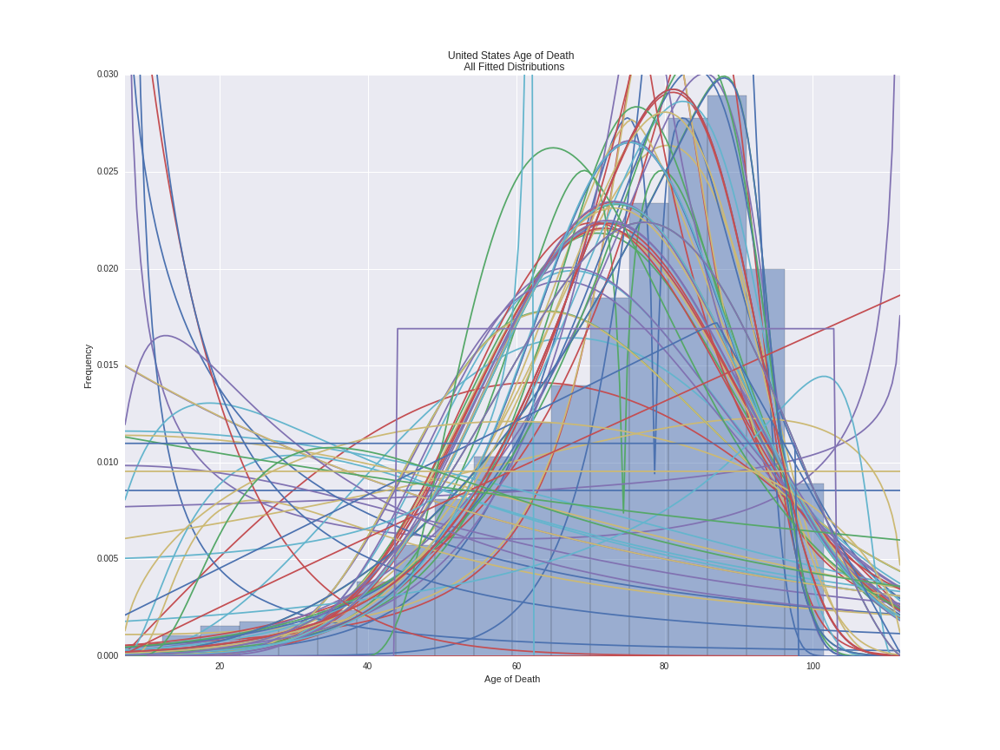
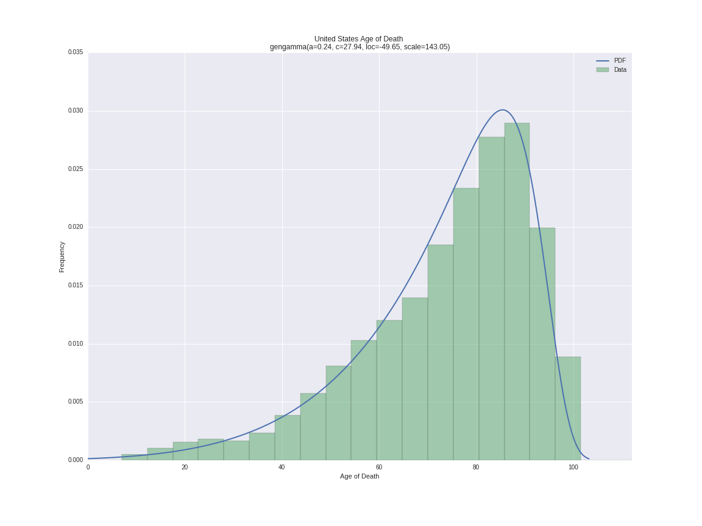

# Fitting Distributions to WHO Mortality Data

All probability distributions from SciPy Stats were fit to World Health Organization global mortality data to find best fit.  Python code can be found in the Jupyter Notebook in the src folder.
 
 

