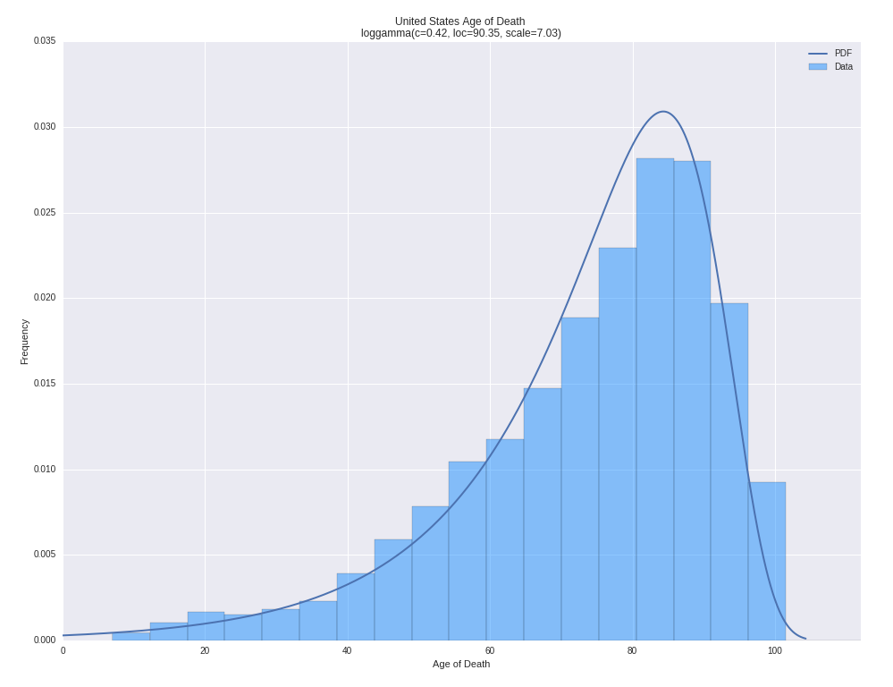
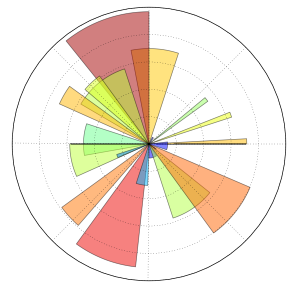

# Fitting Distributions to WHO Mortality by Age Data

#### Figure 1: All distributions in SciPy stats fitted to WHO mortality by age data for the United States.
 
 

#### Figure 2: Best fitting distribution with paramaters.
 
 

All probability distributions from SciPy Stats were fit to World Health Organization global mortality data for the United States.  Images are in the images folder and Python code can be found in the Jupyter Notebook in the src folder.
 
 

